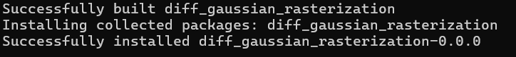
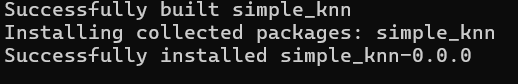

## RTX 5090 environment configuration for 3D Gaussian Splatting

*Original project by [**GraphDECO INRIA**](https://github.com/graphdeco-inria). This document only covers environment setup and build notes for RTX 5090 users.*


### 🔍 Reference for Torch Nightly Compatibility

The correct nightly versions of **Torch** and **TorchVision** (built with CUDA 12.8 and `sm_120` support for RTX 50-series GPUs) were identified based on a 
discussion in the [Fooocus GitHub issue #3862](https://github.com/lllyasviel/Fooocus/issues/3862#issuecomment-2382377741), particularly the post by **@hassan09814** (Sep 7 2025).

Which confirmed that:
- `torch 2.9.0.dev...+cu128`
- `torchvision 0.24.0.dev...+cu128`
- CUDA runtime reported by Torch: **12.8**


### Intro
This guide documents how I successfully built the **3D Gaussian Splatting** repository and its CUDA-based submodules-
`diff-gaussian-rasterization` and `simple-knn` -- on a **Windows 11** workstation with an **RTX 5090** GPU.

I ran into several compiler and compatibility issues during installation, so I’m sharing the complete working setup to help others reproduce it.
Feel free to suggest improvements or point out unnecessary steps.

### Hardware

- **GPU**:NVIDIA RTX 5090 (Compute Capability 12.0)
- **VRAM**: 32 GB

### Software
- **Anaconda**: `conda 25.5.1` (for environment management)
- **Visual Studio 2022 (Build Tools)** – C++ compiler for PyTorch extensions
  
  - **MSVC Version**: `19.44.35217 for x64`

- **CUDA Toolkit 12.8**
- **Python 3.10.18**

Install **Visual Studio 2022 (Build Tools)** before installing the **CUDA Toolkit**,
so the CUDA installer detects the MSVC compiler correctly.

### Setup steps
#### Open the Correct Compiler Prompt
Open 
`x64 Native Tools Command Prompt for VS 2022`
You should see something like: 
`C:\Program Files (x86)\Microsoft Visual Studio\2022\BuildTools>`
Then activate your Conda environment:
```
call "C:\ProgramData\anaconda3\condabin\conda.bat" activate <your environment>
cd "<path of gaussian-splatting repo>"
```

#### Install nightly torch and torchvision
```pip install --pre torch==2.9.0.dev20250909+cu128 torchvision==0.24.0.dev20250902+cu128 --index-url https://download.pytorch.org/whl/nightly/cu128```

You can verify CUDA compatibility via:
```import torch; print(torch.version.cuda, torch.cuda.get_device_capability())```


### Build diff-gaussian-rasterization
- `cd submodules\diff-gaussian-rasterization`, it would show `(your environment) <path of gaussian-splatting repo>\submodules\diff-gaussian-rasterization`

#### Files modified
- `...\gaussian-splatting\submodules\diff-gaussian-rasterization\setup.py`
see the file for details
- `...\gaussian-splatting\submodules\diff-gaussian-rasterization\third_party\glm\glm\detail\compute_common.hpp`

changed 
```
template<> struct compute_abs<float, true> {
    GLM_CONSTEXPR static float call(float x) { return fabsf(x); }
};
``` 
to 
```
template<> struct compute_abs<float, true> {
    __host__ __device__ static inline float call(float x) { return fabsf(x); }
};
```
This change ensures correct compilation for modern CUDA and MSVC versions supporting compute 12.0.

#### Important Build Notes
If the build fails and you want to rebuild **without closing the current window**, you must re-enter the 
commands listed below before running the build again.

```
:: Required with VS env active
set DISTUTILS_USE_SDK=1
set MSSdk=1

:: Match your GPU architecture
set TORCH_CUDA_ARCH_LIST=12.0+PTX

:: Match your CUDA installation path
set CUDA_HOME=C:\Program Files\NVIDIA GPU Computing Toolkit\CUDA\v12.8

```
Check your environment:

```
echo %TORCH_CUDA_ARCH_LIST%    :: should print 12.0+PTX
echo %CUDA_HOME%               :: should print your CUDA path, e.g., C:\Program Files\NVIDIA GPU Computing Toolkit\CUDA\v12.8

```

Clean and rebuild:
```
python setup.py clean
rmdir /s /q build dist *.egg-info 2>nul
python -m pip install -v . --no-build-isolation

```


**If successful**, you will see:



### Build simple-knn
go to `(your environment) <path of gaussian-splatting repo>\submodules\simple-knn`

#### Files modified
- Add an empty `__init__.py` inside `...\submodules\simple-knn\simple-knn`
- `...\submodules\simple-knn\setup.py`
see the file for details

#### Then repeat the same build commands as above (see “Notice” section).
**If successful**, you will see:



### Verification
After both submodules install correctly:

`python -c "import diff_gaussian_rasterization, simple_knn; print('✅ Modules loaded successfully!')"`

You can now proceed to run 3D GS training or rendering scripts.

### Additional Tips (for 5090 users)
You can confirm compute capability via:
`nvidia-smi --query-gpu=name,compute_cap --format=csv`

### 🙏 Acknowledgments
- [GraphDECO INRIA](https://github.com/graphdeco-inria) for the original 3D Gaussian Splatting project  
- [@hassan09814’s post](https://github.com/lllyasviel/Fooocus/issues/3862#issuecomment-2382377741) on the 
Fooocus GitHub – Provided the working Torch 2.9.0 dev + cu128 configuration for RTX 5090
- [ChatGPT](https://chat.openai.com/) for help in diagnosing and fixing build errors on RTX 5090  
- The PyTorch and CUDA developer community for their detailed build discussions


